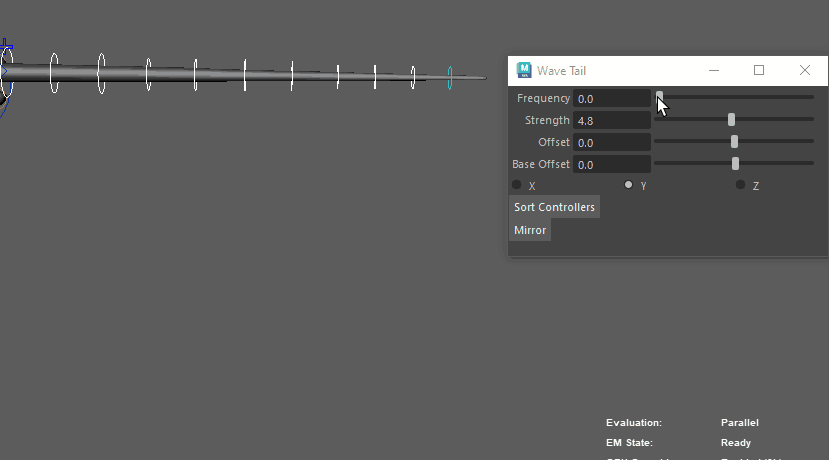
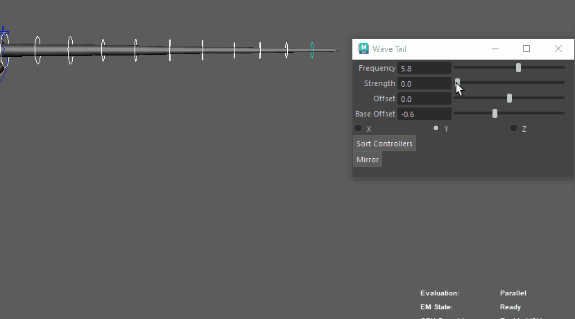
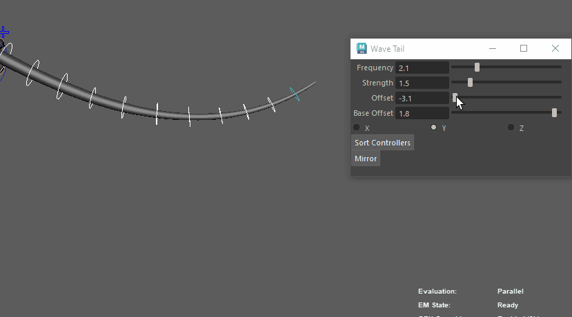
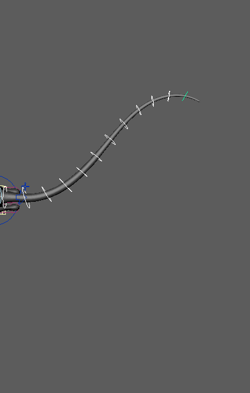

# test_python

## Description
`wave_tail.py` is a tool for FK chain shaping.

## Installation
Copy `wave_tail.py` in Maya scripts folder.

Run :
```
import wave_tail
wave_tail.start()
```

## Usage
Use the sliders to make a nice shape.







## To Do
- [x] Add x, y and z checkboxes to choose rotation axis
- [x] Sort button : reorganize controllers selection if not hierarchically sorted
- [x] Mirroring
- [x] Make a `stable` branch, wrap up a 0.1 version and push it with a `tag`
- [x] Make a real README with pictures and gifs
- [ ] Better UI Layout
- [ ] Select from base : select all controllers down an FK base
- [ ] Installation script
- [ ] Qt UI
- [ ] Localization
- [ ] Animation keys functions
- [ ] Try to turn it into a plugin
- [ ] Add comments and useful documentation
- [ ] Error handling
- [ ] Infer parameters from controllers
- [ ] More precise and useful parameters
- [ ] Save parameters
- [ ] Make an installation drag and drop

## License
The MIT License 2020 - Tom Mielczarek
